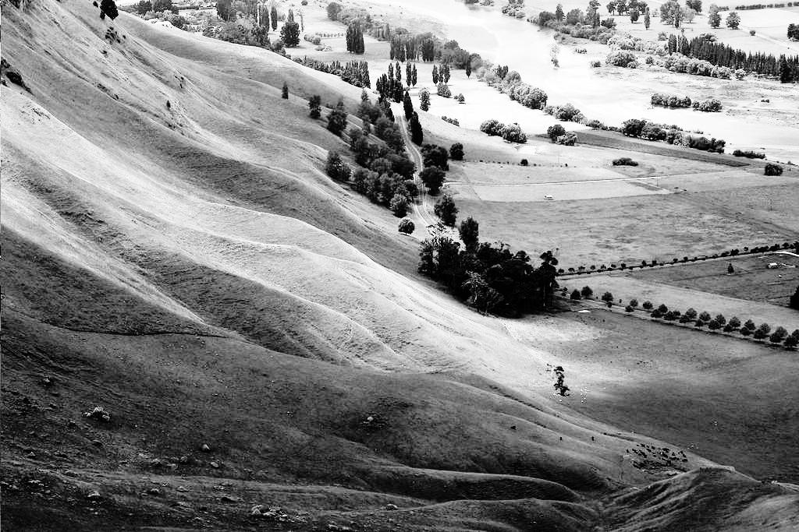

# 直方图均衡

直方图均衡化是一种**图像处理**方法，用于 **调整图像对比度** ，通过重新分配像素值，使整个图像的亮度值在**直方图**上更均匀地分布。

## **基本思路**

该方法通常能提高图像的整体对比度，特别是当图像的亮度值范围较窄时。通过这种调整， **像素强度得到了更均匀的分布** ，利用整个强度范围，使得局部低对比度区域获得更高对比度。直方图均衡化通过有效地**扩展高密度的亮度值**来改善图像对比度。

这种方法对背景和前景亮度相似的图像特别有用。例如，在 **X射线** （X-ray）图像中，它可以使**骨骼结构**更清晰，在曝光不足或曝光过度的照片中可以提取更多的细节。该方法的**主要优点**是计算简单，并且在理论上是可逆的，即如果已知直方图均衡化的 **转换函数** ，则可以恢复原始直方图。

**缺点**在于，直方图均衡化是一种全局调整方法，它可能会增强背景噪声，同时降低有用信号的质量。在低 **色深** （color depth）的图像上应用时，它可能会导致色阶的丢失，从而影响图像质量。

## **实现**

假设我们有一幅**离散灰度图像** $x$，并且**灰度级** $i$ 在图像中出现的次数为 $n_i$。那么像素级别为 $i$ 的像素出现的概率为：

$$
p_x(i) = p(x = i) = \frac{n_i}{n},\quad 0 \leq i < L
$$

其中，$L$ 是图像的**总灰度级数**（通常为 256），$n$ 是图像的**总像素数**，而 $p_x(i)$实际上就是图像的**直方图**，归一化到区间 $[0,1]$。

### **累计分布函数（CDF）**

我们定义与灰度级 \(i\) 相关的**累计分布函数（CDF, Cumulative Distribution Function**如下：

$$
\operatorname{cdf}_x(i) = \sum_{j=0}^{i} p_x(x = j)
$$

这实际上是图像**累积归一化直方图**。

### **构造变换函数**

我们的目标是构造一个变换函数：

$$
y = T(x)
$$

以生成一幅新的图像 ${y}$，使其具有**均匀的直方图**。这样的图像将具有线性化的**累积分布函数（CDF）**，即：

$$
\operatorname{cdf}_y(i) = (i+1)K, \quad 0 \leq i < L
$$

其中 $K$ 为某个常数。CDF 的性质允许我们进行如下变换：

$$
y = T(k) = \operatorname{cdf}_x(k)
$$

其中 $k$ 的取值范围为：

$$
[0, L-1]
$$

请注意，由于我们使用的是归一化直方图，$T$ 将像素值映射到$ [0,1]$之间。为了将这些值映射回其原始范围，需要进行以下简单变换：

$$
y' = y \cdot (\max\{x\} - \min\{x\}) + \min\{x\} = y \cdot (L-1)
$$

即：

$$
y' = y \cdot (L-1)
$$

### **离散化（Quantization）**

由于 $y$ 是实数，而 **$y'$ 需要是整数**，因此一个直观且流行的方法是应用**四舍五入（round）**操作：

$$
y' = \operatorname{round}(y \cdot (L-1))
$$

然而，经过详细分析后，得到的**更精确的**量化公式略有不同：

- 当 $0 < y \leq \frac{1}{L}$时，$y' = 0$
- 当$ \frac{1}{L} < y \leq \frac{2}{L}$时，$y' = 1$
- 当$ \frac{2}{L} < y \leq \frac{3}{L} $时，$y' = 2$
- …
- 最终当$\frac{L-1}{L} < y \leq 1$时，$y' = L-1$

因此，从 \(y\) 到 \(y'\) 的量化公式应为：

$$
y' = \operatorname{ceil}(L \cdot y) - 1
$$

请注意：

- 当 \(y = 0\) 时，理论上 \(y' = -1\)，但这种情况不会发生，因为 \(y = 0\) 表示图像中没有对应的像素值。

以上便是**直方图均衡化的数学实现过程**。


# 直方图匹配

直方图匹配（Histogram Matching）也称为直方图规范化（Histogram Specification），其目标是将一幅图像的直方图转换为预先指定的直方图分布，而不仅仅是均匀化直方图。下面是在直方图均衡化理论基础上对直方图匹配的补充说明。

## **基本思路**

直方图匹配的核心思想是：  
1. **均衡化原始图像**：首先对源图像 $$x$$ 应用直方图均衡化，得到新的像素值 $$y$$。  
2. **均衡化目标直方图**：同时，对于目标直方图（我们希望图像达到的直方图分布），定义其概率密度函数 $$p_z(z)$$ 和累计分布函数（CDF）$$\operatorname{cdf}_z(z)$$。  
3. **反变换**：利用目标直方图的 CDF，将已均衡化的值 $$y$$ 映射为目标图像的灰度级 $$z$$，使得 $$z$$ 的分布尽可能接近预定的直方图。

## **数学原理**

### **1. 对源图像进行直方图均衡化**

如同直方图均衡化的过程所述，我们首先计算源图像的归一化直方图和累计分布函数：

- **归一化直方图：**

  $$
  p_x(i) = \frac{n_i}{n},\quad 0 \leq i < L
  $$

- **累计分布函数（CDF）：**

  $$
  \operatorname{cdf}_x(i) = \sum_{j=0}^{i} p_x(j)
  $$

构造变换函数 $$T$$ 如下：

$$
y = T(x) = \operatorname{cdf}_x(x)
$$

此时，$$y$$ 的取值位于 $$[0,1]$$，随后再映射回 $$[0, L-1]$$ 并离散化，得到均衡化图像。

### **2. 对目标直方图进行均衡化**

对于目标直方图，我们也可以定义一个累计分布函数（假设目标图像的灰度级为 $$z$$）：

- **目标直方图的 CDF：**

  $$
  \operatorname{cdf}_z(z) = \sum_{j=0}^{z} p_z(j)
  $$

其中 $$z$$ 同样在 $$[0, L-1]$$ 的范围内。

### **3. 构造直方图匹配变换**

直方图匹配的目标是找到一个映射函数 $$G$$，使得对于源图像中每个像素 $$x$$：

1. 计算其均衡化后的值 $$y = \operatorname{cdf}_x(x)$$；
2. 找到目标图像中对应的灰度级 $$z$$，使得

   $$
   \operatorname{cdf}_z(z) \approx y
   $$

换句话说，我们需要求出：

$$
z = G(y) = \operatorname{cdf}_z^{-1}(y)
$$

综合起来，直方图匹配的整体映射函数 $$H$$ 就是将源图像的像素 $$x$$ 映射到目标灰度级 $$z$$：

$$
z = H(x) = G\big(T(x)\big) = \operatorname{cdf}_z^{-1}\big(\operatorname{cdf}_x(x)\big)
$$

这样，经过映射后的图像 $$z$$ 将具有与目标直方图相近的分布。

## **实现步骤**

1. **计算源图像的直方图和 CDF**  
   对图像 $$x$$ 计算 $$p_x(i)$$ 和 $$\operatorname{cdf}_x(i)$$。

2. **计算目标直方图的 CDF**  
   根据目标分布或目标图像，计算 $$p_z(i)$$ 和 $$\operatorname{cdf}_z(i)$$。

3. **求取映射关系**  
   对于每个可能的灰度级 $$i$$：
   - 计算 $$y = \operatorname{cdf}_x(i)$$；
   - 在目标 CDF 中找到灰度级 $$z$$ 使得 $$\operatorname{cdf}_z(z)$$ 最接近 $$y$$；
   - 将 $$i$$ 映射到 $$z$$。

4. **构造新图像**  
   利用上述映射关系，对源图像的每个像素值进行替换，从而获得直方图匹配后的图像。

## **注意事项**

- **离散化问题**：由于累计分布函数的值通常是连续的，在实际计算中往往需要进行插值或选择最接近的离散值。
- **逆函数的求解**：$$\operatorname{cdf}_z^{-1}$$ 在理论上可能没有明确解析表达式，因此在实际算法中，通常采用查找或插值的方法来求逆映射。
- **细节处理**：对于边界条件（例如 $$y = 0$$ 或 $$y = 1$$）需要特别处理，以防止映射出界。


## **示例**

下面是一个直方图均衡化前后的示例：

| 原始图像                                                     | 直方图匹配后              |
| ------------------------------------------------------------ | ------------------------- |
|  |  |

如图所示，均衡化后，图像的对比度明显增强，使得原本较暗或较亮的区域更加清晰。

### python代码

```python
import numpy as np
import matplotlib.pyplot as plt
import cv2
```


```python
# 读取图像
img = cv2.imread('Unequalized.jpg')
plt.imshow(img)
plt.axis('off')
plt.title('Original Image')
plt.show()
```


```python
gray = cv2.cvtColor(img, cv2.COLOR_BGR2GRAY) # 转换为灰度图像
counts, bins = np.histogram(gray,bins=np.linspace(0,255,256)) # 计算直方图
```


```python
# 计算PDF
counts = np.array(counts)
pdf = counts / np.sum(counts)
# plt.stairs(pdf, bins, fill=True)
# plt.xlim([0,255])
# plt.show()
# 计算CDF
cdf = np.cumsum(pdf)
# plt.stairs(cdf)
# plt.xlim([0,255])
# plt.show()
# np.shape(cdf)

# 创建一个图形对象
fig, ax1 = plt.subplots(figsize=(10, 5))
# 绘制PDF
ax1.stairs(pdf, bins, fill=True, label='PDF',color = "steelblue")
ax1.set_xlabel('Bins')
ax1.set_ylabel('PDF',color = "steelblue")
ax1.tick_params(axis='y',labelcolor = "steelblue")
ax1.set_xlim([0, 255])

# 创建第二个y轴，共享x轴
ax2 = ax1.twinx()
ax2.stairs(cdf, bins, label='CDF',color ='darkorange' )
ax2.set_ylabel('CDF',color='darkorange')
ax2.tick_params(axis='y',labelcolor='darkorange')

# 设置图形标题
plt.title('PDF and CDF')

# 显示图形
fig.tight_layout()
plt.show()
```


```python
# 参考直方图
mat_counts = np.floor(np.ones(np.size(counts)) * (sum(counts)/len(counts)))

mat_pdf = mat_counts / np.sum(mat_counts)
mat_cdf = np.cumsum(mat_pdf)

fig, ax1 = plt.subplots(figsize=(10, 5))
# 绘制PDF
ax1.stairs(mat_pdf, bins, fill=True, label='PDF',color = "steelblue")
ax1.set_xlabel('Bins')
ax1.set_ylabel('Ref_PDF',color = "steelblue")
ax1.tick_params(axis='y',labelcolor = "steelblue")
ax1.set_xlim([0, 255])

# 创建第二个y轴，共享x轴
ax2 = ax1.twinx()
ax2.stairs(mat_cdf, bins, label='CDF',color ='darkorange' )
ax2.set_ylabel('Ref_CDF',color='darkorange')
ax2.tick_params(axis='y',labelcolor='darkorange')

# 设置图形标题
plt.title('Reference PDF and Reference CDF')

# 显示图形
fig.tight_layout()
plt.show()
```


```python
# 直方图匹配
map_table = np.around(255 * cdf)
map_table = map_table.astype(np.uint8)
equalized_img = map_table[gray]
plt.imshow(equalized_img, cmap='gray')
plt.title('Matched Image')
plt.axis('off')
plt.show()
cv2.imwrite('Matched.jpg', equalized_img)
```


原始图像灰度值的 PDF 是集中在120-200之间的，而不是均匀分布的，说明大部分像素落在一个狭窄的灰度区间内，对比度较低，CDF在120-200之间增长很快。

参考直方图所有灰度值是均匀分布的，CDF接近线性，为一条从左下角到右上角的直线。

经过直方图匹配后，PDF 变得更加均匀，像素灰度值的分布更加均匀地扩展到整个灰度范围（0-255）经过均衡化后，CDF 接近线性，即它的增长趋势接近一条对角线（从左下角到右上角)。这意味着灰度值的分布更加均匀，使得整个图像的亮度更具可辨识性，提高了对比度。

### **总结**

直方图均衡化是一种简单有效的图像增强技术，适用于许多不同的应用领域。然而，它也有一定的局限性，例如可能会增强噪声或影响图像的自然感。针对这些问题，许多改进方法（如 CLAHE）已被提出，以提高算法的适用性和效果。

对于彩色图像，转换到**Lab 颜色空间**进行亮度通道的均衡化，是一种更好的方法，以避免颜色失真。

直方图匹配在直方图均衡化的基础上引入了一个目标直方图，使得图像处理不仅仅局限于对比度的增强，还能将图像的灰度分布调整为期望的特定形态。该方法先将源图像均衡化，再通过目标 CDF 的逆映射实现灰度级的转换，从而达到预期的直方图效果。


---


# 视频运动前景目标提取算法

### **1. 帧差法（Frame Difference）**
**核心思想**：通过比较视频序列中相邻帧（或间隔帧）的像素差异，检测运动目标。  
**实现方式**：  
- **两帧差分法**：当前帧与前一帧作差，二值化后得到运动区域。  
- **三帧差分法**：利用前帧、当前帧、后帧的差异，减少“空洞”现象。  

**优点**：  
- 计算简单，实时性高（适合低算力场景）。  
- 对静态背景鲁棒，无需预存背景模型。  
- 适应缓慢光照变化（仅依赖短期帧差异）。  

**缺点**：  
- 目标内部易出现“空洞”（相似区域差异小）。  
- 对快速运动敏感，易产生拖影或断裂。  
- 依赖帧间隔选择：间隔过小则目标区域小，间隔过大会漏检。  
- 无法分离重叠目标。  

**典型应用**：实时监控、简单运动检测（如跌倒检测）。

---

### **2. 背景减除法（Background Subtraction）**
**核心思想**：建立背景模型，将当前帧与背景模型对比提取前景。  
**实现方式**：  
- **静态背景建模**：如均值法、中值法（适用于固定摄像头）。  
- **动态背景建模**：如高斯混合模型（GMM）、ViBe、光流法（适应动态背景）。  

**优点**：  
- 目标提取完整，内部无空洞。  
- 可处理复杂场景（如树叶晃动、水面波纹）。  
- 抗噪声能力较强（通过概率模型过滤噪声）。  

**缺点**：  
- 计算复杂度高（需维护背景模型）。  
- 对光照突变敏感（如突然开灯）。  
- 初始化需纯背景帧（动态建模需训练时间）。  
- 动态背景（如摄像头抖动）需额外处理（如稳像）。  

**典型应用**：交通监控、人体行为分析、复杂场景目标跟踪。

---

### **3. 对比总结**

| **维度**       | **帧差法**           | **背景减除法**                  |
| -------------- | -------------------- | ------------------------------- |
| **原理**       | 基于帧间差异         | 基于背景模型与当前帧对比        |
| **计算复杂度** | 低（仅需像素级减法） | 高（需建模与更新背景）          |
| **目标完整性** | 易断裂、空洞         | 完整轮廓                        |
| **抗干扰能力** | 弱（噪声敏感）       | 强（概率模型过滤噪声）          |
| **适用场景**   | 静态背景、实时系统   | 动态背景、复杂环境              |
| **光照适应性** | 适应短期渐变         | 依赖模型（如GMM可处理部分突变） |
| **初始化要求** | 无需初始化           | 需背景建模或训练阶段            |
| **典型算法**   | 两帧/三帧差分法      | GMM、ViBe、Codebook             |

---

### **4. 混合方法与发展趋势**
- **结合策略**：将帧差法作为预处理，结合背景减除法提升实时性（如动态更新背景模型）。  
- **深度学习**：基于CNN的端到端方法（如Mask R-CNN）逐步替代传统算法，但算力需求高。  
- **边缘计算优化**：轻量级背景建模（如SuBSENSE）在嵌入式设备中的应用。  

**选择建议**：  

- 实时性优先 → 帧差法（如嵌入式摄像头）。  
- 精度优先 → 背景减除法（如智能交通系统）。  
- 动态环境 → 混合算法或深度学习模型。

### python代码

- 帧差法

  ```python
  import cv2
  
  # 打开视频文件或摄像头
  cap = cv2.VideoCapture('video.mp4')  # 如果使用摄像头，请将'video.mp4'替换为0
  
  # 读取第一帧
  ret, frame1 = cap.read()
  if not ret:
      print("无法读取视频源")
      cap.release()
      cv2.destroyAllWindows()
      exit()
  
  # 将第一帧转换为灰度图像
  gray1 = cv2.cvtColor(frame1, cv2.COLOR_BGR2GRAY)
  
  while True:
      # 读取下一帧
      ret, frame2 = cap.read()
      if not ret:
          break
  
      # 将当前帧转换为灰度图像
      gray2 = cv2.cvtColor(frame2, cv2.COLOR_BGR2GRAY)
  
      # 计算两帧之间的差分
      diff = cv2.absdiff(gray1, gray2)
  
      # 对差分图像进行阈值处理
      _, thresh = cv2.threshold(diff, 25, 255, cv2.THRESH_BINARY)
  
      # 使用形态学操作去除噪声
      kernel = cv2.getStructuringElement(cv2.MORPH_RECT, (5, 5))
      thresh = cv2.morphologyEx(thresh, cv2.MORPH_CLOSE, kernel)
      thresh = cv2.morphologyEx(thresh, cv2.MORPH_OPEN, kernel)
  
      # 查找轮廓
      contours, _ = cv2.findContours(thresh, cv2.RETR_EXTERNAL, cv2.CHAIN_APPROX_SIMPLE)
  
      # 绘制轮廓
      for contour in contours:
          if cv2.contourArea(contour) > 500:  # 忽略小面积的噪声
              x, y, w, h = cv2.boundingRect(contour)
              cv2.rectangle(frame2, (x, y), (x + w, y + h), (0, 255, 0), 2)
  
      # 显示结果
      cv2.imshow('Frame', frame2)
      cv2.imshow('Thresh', thresh)
  
  
      key = cv2.waitKey(30) & 0xFF
      if key == ord('q'):
          break
      elif key == ord('p'):
          # 暂停并保存当前帧和前景掩码
          cv2.imwrite('frame2.png', frame2)
          cv2.imwrite('thresh.png', thresh)
          print("Frame and Foreground Mask saved as 'frame2.png' and 'thresh.png'")
          while True:
              # 等待按下 'p' 键继续
              if cv2.waitKey(30) & 0xFF == ord('p'):
                  break
      # 更新前一帧
      gray1 = gray2
  
  # 释放资源
  cap.release()
  cv2.destroyAllWindows()
  ```

- 背景减除法

  ```python
  import cv2
  
  # 打开视频文件或摄像头
  cap = cv2.VideoCapture('video.mp4')  # 如果使用摄像头，请将 'video.mp4' 替换为 0
  
  # 创建背景减除器（以MOG2为例）
  back_sub = cv2.createBackgroundSubtractorMOG2(history=500, varThreshold=16, detectShadows=True)
  
  while True:
      # 读取视频帧
      ret, frame = cap.read()
      if not ret:
          break
  
      # 应用背景减除器
      fg_mask = back_sub.apply(frame)
  
      # 使用形态学操作去除噪声
      kernel = cv2.getStructuringElement(cv2.MORPH_ELLIPSE, (3, 3))
      fg_mask = cv2.morphologyEx(fg_mask, cv2.MORPH_OPEN, kernel)
      fg_mask = cv2.morphologyEx(fg_mask, cv2.MORPH_CLOSE, kernel)
  
      # 查找前景物体的轮廓
      contours, _ = cv2.findContours(fg_mask, cv2.RETR_EXTERNAL, cv2.CHAIN_APPROX_SIMPLE)
  
      # 绘制轮廓
      for contour in contours:
          if cv2.contourArea(contour) > 500:  # 忽略小面积的噪声
              x, y, w, h = cv2.boundingRect(contour)
              cv2.rectangle(frame, (x, y), (x + w, y + h), (0, 255, 0), 2)
  
      # 显示结果
      cv2.imshow('Frame', frame)
      cv2.imshow('Foreground Mask', fg_mask)
  
      key = cv2.waitKey(30) & 0xFF
      if key == ord('q'):
          break
      elif key == ord('p'):
      # 暂停并保存当前帧和前景掩码
          cv2.imwrite('paused_frame.png', frame)
          cv2.imwrite('paused_fg_mask.png', fg_mask)
          print("Frame and Foreground Mask saved as 'paused_frame.png' and 'paused_fg_mask.png'")
          while True:
              # 等待按下 'p' 键继续
              if cv2.waitKey(30) & 0xFF == ord('p'):
                  break
  
  # 释放资源
  cap.release()
  cv2.destroyAllWindows()
  ```

  ### 结果对比

  #### **1. 帧差法：速度优先，细节受限**

  **计算速度快的核心原因**：  
  - **算法复杂度低**：仅需相邻帧（或间隔帧）的像素级减法（\(O(N)\)，无需维护复杂模型。  
    - 例如，处理一张 1080p 帧（约 200 万像素），仅需遍历所有像素一次，计算每个位置的绝对差值。  
  - **内存占用极低**：只需缓存 1-2 帧数据，适合嵌入式设备（如摄像头芯片、无人机）。  
  - **无模型更新开销**：直接依赖帧间差异，省去背景建模的迭代计算（如 GMM 的 EM 算法）。  

  **细节较少的具体表现**：  
  1. **目标内部空洞**：  
     - 若目标颜色均匀（如穿纯色衣服的人），相邻帧差异可能仅捕捉到边缘，导致目标内部缺失。  
     - **示例**：行人挥手时，手臂运动被检测，但躯干因颜色一致未被识别（如图 1a）。  
  2. **边缘断裂与拖影**：  
     - 快速移动目标（如奔跑的运动员）在连续帧中位置变化大，导致差分区域不连续，形成断裂或拖尾伪影。  
  3. **无法分离重叠目标**：  
     - 多个运动目标重叠时（如人群聚集），帧差法会将其合并为单一区域，丢失个体信息。  

  <figure>
  	<div style="display: flex; justify-content: center;">
      	
      	
  	</div>
      <figcaption><center>帧差法</center></figcaption>
  </figure>
  
  

  #### **2. 背景减除法：细节丰富，速度妥协**
  **计算较慢的根本原因**：  
  - **背景建模复杂度高**：  
    - **静态模型**：均值/中值法需历史帧统计计算（如 30 帧均值），初始化阶段耗时。  
    - **动态模型**：高斯混合模型（GMM）需为每个像素维护多个高斯分布（如 \(K=3\)），更新权重、均值、方差（复杂度 \(O(K $\cdot$ N)\)）。  
    - **示例**：处理 1080p 帧时，GMM 需对每个像素进行 3 次高斯分布计算，内存占用高达数百 MB。  
  - **实时更新开销**：动态背景模型需逐帧更新（如 ViBe 的随机替换策略），占用额外计算资源。  

  **细节丰富的核心优势**：  
  1. **完整目标轮廓**：  
     - 背景模型提供全局参考，即使目标静止片刻，仍可通过对比背景提取完整形状。  
     - **示例**：车辆在路口停车时，背景减除法仍能保留车身轮廓，而帧差法可能因车辆静止而漏检。  
     
  2. **抗内部空洞**：  
     - 通过概率模型（如 GMM）区分前景与背景，目标内部均匀区域也能被识别（依赖颜色与背景差异）。  
     
  3. **重叠目标分离**：  
     - 结合形态学处理或连通域分析，可分离部分重叠目标（如交通监控中并行的车辆）。  
     
     <figure>
     	<div style="display: flex; justify-content: center;">
         	
         	
     	</div>
         <figcaption><center>背景减除法</center></figcaption>
     </figure>

  
